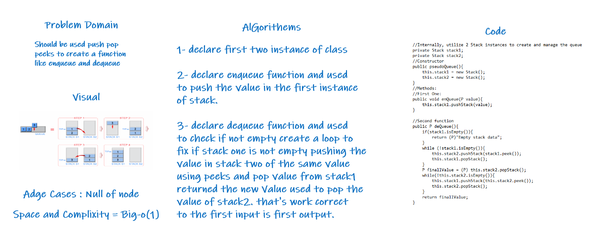

>You need to thinking how i can used to instance from stack

>In both Stack and Queue we have first out 

>The Difference is in the `In` and can be declare two Stack instance the first one used to push the value and the second one is to reversed to go out in the first.

>Takes nearly of 2 hours

>Ali Akef Abed AlRahman

>`Used Speciallest mind thinking ^_^`

>Complixity Big-o(1)

