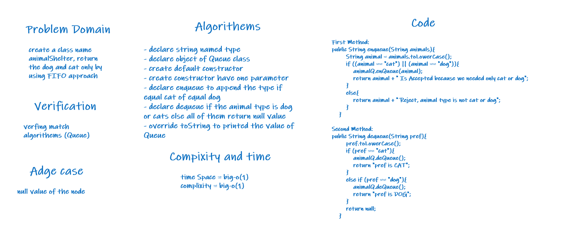

>Ali Akef Abed AlRahman

>Code Challenge 12 

# Challenge Summary

>Used the queue function to entered the value of animal type if animal type is cat or dogs

## Solution

>Shown in test and run the app class

## Approach & Efficiency

>Complixity Big-o(1)

## Whiteboard Process

