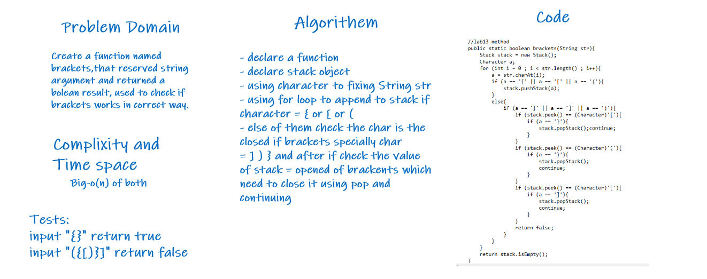

# Challenge Summary

**Multi-bracket Validation , Write a method called validate brackets that accepts a string parameter and return a boolean value representing whether or not the brackets in the string are balanced**

## Whiteboard Process

## Approach & Efficiency

BIG-O (N) of the compixity and time space

## Solution

using brackets method.
