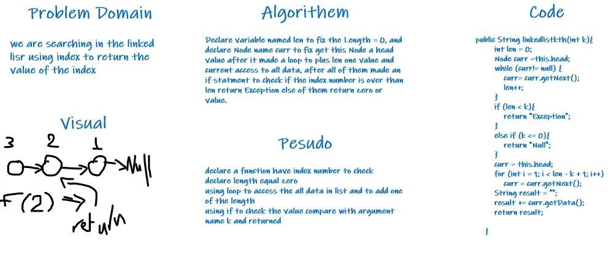

# Challenge Summary

in the algorithems you can show the describ and in the pesudo can be shown the steps.

## Whiteboard Process
<!-- Embedded whiteboard image -->

## Approach & Efficiency

Big-o(N)

## Solution

seen in the visual how to run and it's return the value of index number sended using the argument value.