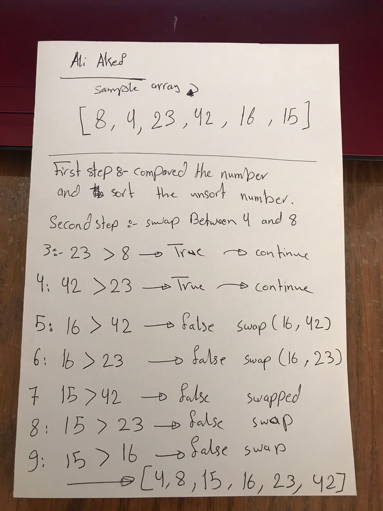
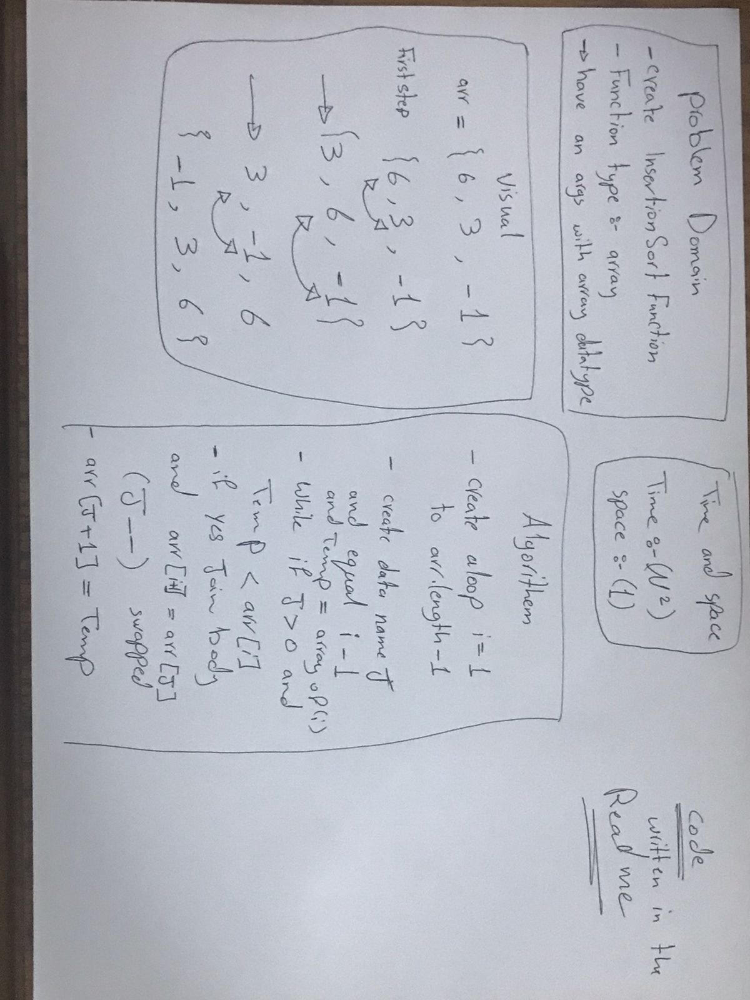

# Insertion Sort

## PseudoCode

    InsertionSort(int[] arr)

        FOR i = 1 to arr.length

        int j <-- i - 1
        int temp <-- arr[i]

        WHILE j >= 0 AND temp < arr[j]
            arr[j + 1] <-- arr[j]
            j <-- j - 1

        arr[j + 1] <-- temp

>-----------------------

## JavaCode

    public static int[] InsertionSort(int[] arr){
        for (int i = 1 ; i < arr.length ; i++){
                int j = i-1;
                int temp = arr[i];
                while(j >= 0 && temp < arr[j]){
                    arr[j+1] = arr[j];
                    j--;
                }
                arr[j+1] = temp;
            }
            return arr;
        }

>-----------

## Image Describes:

>-----------

## Describe: 

>**Selection Sort is a sorting algorithm that traverses the array multiple times as it slowly builds out the sorting sequence. The traversal keeps track of the minimum value and places it in the front of the array which should be incrementally sorted.**

>-------

## Time and Space

>**Time Compixity: Big-o(n^2)**

>**Space: Big-o(1)**

>---------------------

## WhiteBoard

