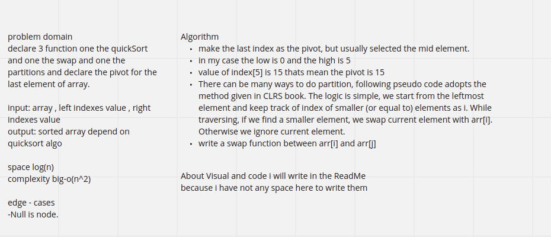
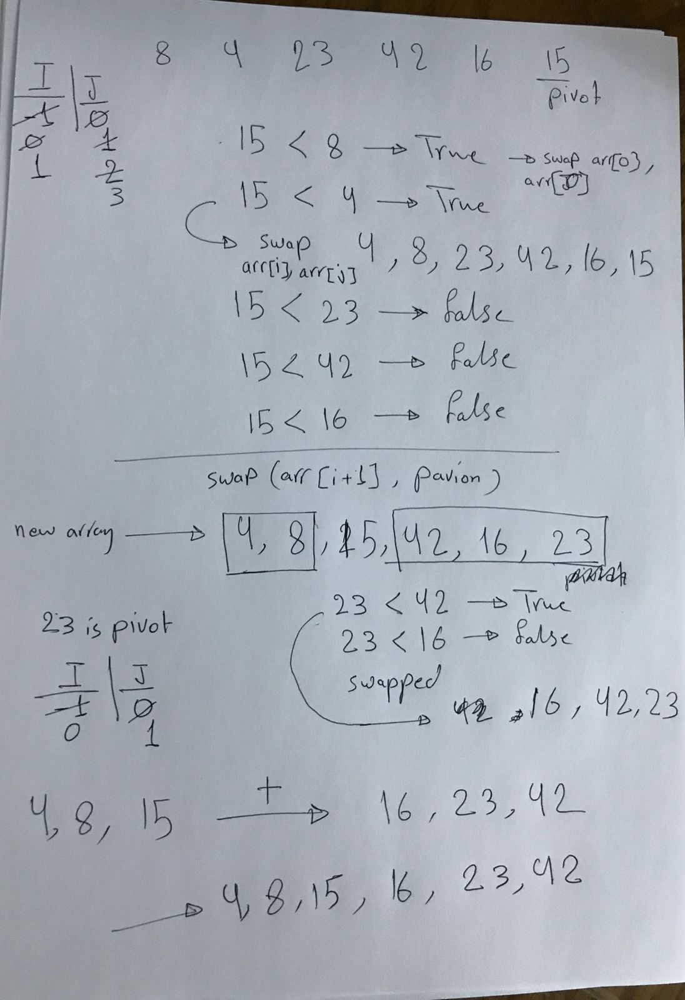
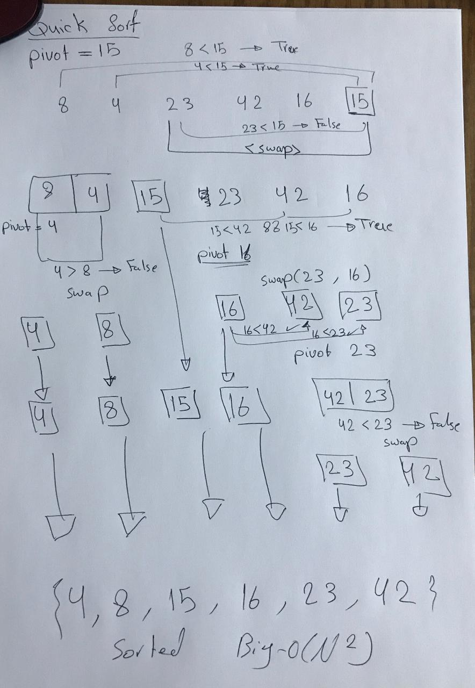

# Descripe of challenges

>**The QuickSort is a function created to sort the element of array depends on select random value like in the last in the first or now we have an algorithems selected this random number depends on some proparities and this random number named `pivot` this pivot wors as if the value of left index is less than it the I value which started as -1 is plus one and swapped for the array of index i and index j.**

# WhiteBoard

# Blogs and `Visual`

# Code

    //quickSort
    public static int[] QuickSort(int[] arr, int left, int right) {
        if (left < right) {
            int position = Partition(arr, left, right);
            QuickSort(arr, left, position - 1);
            QuickSort(arr, position + 1, right);
        }
        return arr;
    }

    //Partition
    public static int Partition(int[] arr, int left, int right) {
        int pivot = arr[right];
        int i = left - 1;
        for (int val = left; val < right; val++) {
            if (arr[val] < pivot) {
                i++;
                swapElement(arr, i, val);
            }
        }
        swapElement(arr, i + 1, right);
        return (i + 1);
    }

    //Swapped
    public static void swapElement(int[] arr, int i, int val) {
        int temp = arr[i];
        arr[i] = arr[val];
        arr[val] = temp;
    }

# Space and Complixity

**BestCase: nLog(n)**

`WorstCase: n^2`

