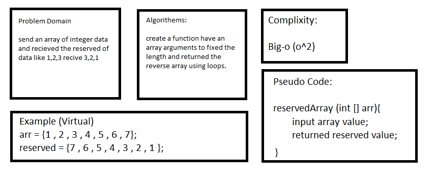

# data-structures-and-algorithms-401

## reserved Array:

>In this Challenges we need to reserve an array element.

## White Board Image:

`In Image the Complixity is O^2 but it O^1 I can't edited because i used the Paint`

## Code

`import java.util.Arrays;`

`public class reverseArray {`

`public static int [] reverseArray(int [] arr){`

`int[] newArr = new int[arr.length] ;`

`int indexer = arr.length - 1;`

`for(int i =0 ; i < arr.length ; i++){`

`newArr[i] = arr[indexer];`

`indexer--;`

`}`

`return  newArr ;`

`}`

`public static void main(String[] args) {`

`int [] testArr = {1,2,3,4,5,6,7,8,9,10};`

`System.out.println(Arrays.toString(reverseArray(testArr)));`

`}`

`}`

## Approach & Efficiency

>The Complixity is big-O( o ) made a loop to reversed value of array. 
        
        