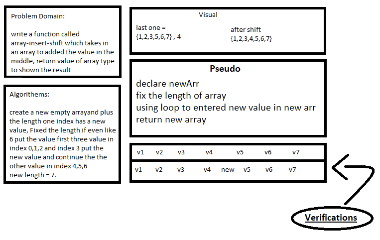

# Insert to Middle of an Array
<!-- Description of the challenge -->
We using this function to fixed the size of an array and put the value in the middle.

## Whiteboard Process
<!-- Embedded whiteboard image -->

## Approach & Efficiency
<!-- What approach did you take? Discuss Why. What is the Big O space/time for this approach? -->
Big-o (O) 
complixity is low becaus i used only one ForLoop not nested to be over than (O)