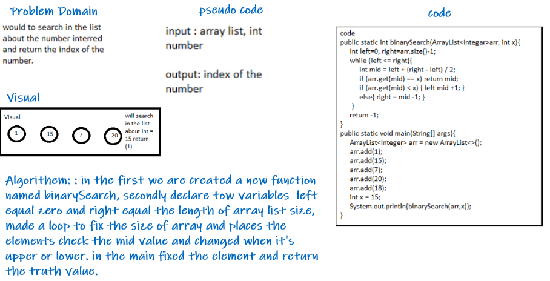

# Binary Search of Sorted Array

>in this challenge created method to search about number in the arraylist and return the index of the number

# WhiteBoard

# Approach & Efficiency

>Array and divided it and still search to find the number to return the index