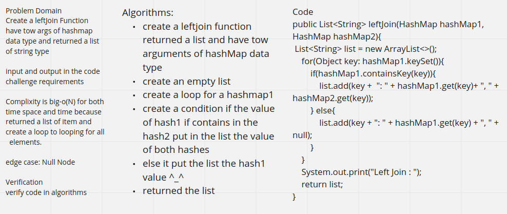

# Challenge Summary

function that LEFT JOINs two hashmaps into a single data structure if the both is have a same key returned both else returned the left side only.

# WhiteBoard

# Approach & Efficiency

>Big O(n)