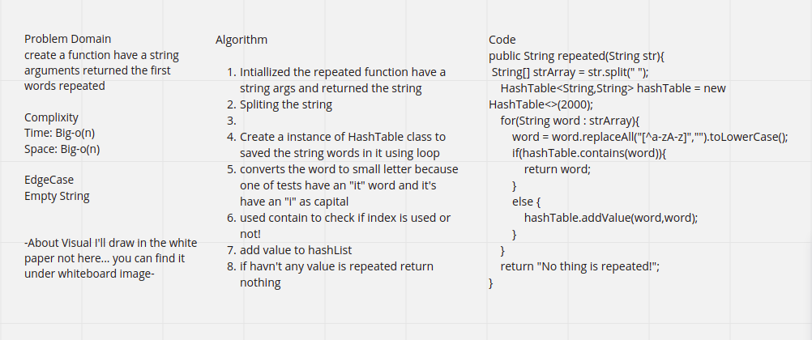
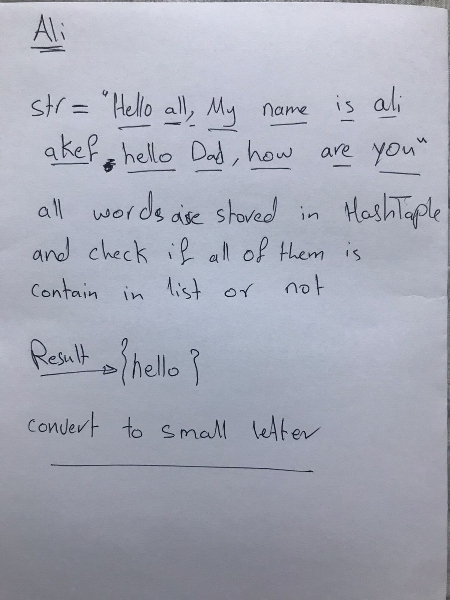

# Challenge Summary

>We Need to find which word is repeated many time for the first

## Whiteboard Process

## Approach & Efficiency

Big-o(N) for both time complixity and space

## Solution

Run the tests and Code application file