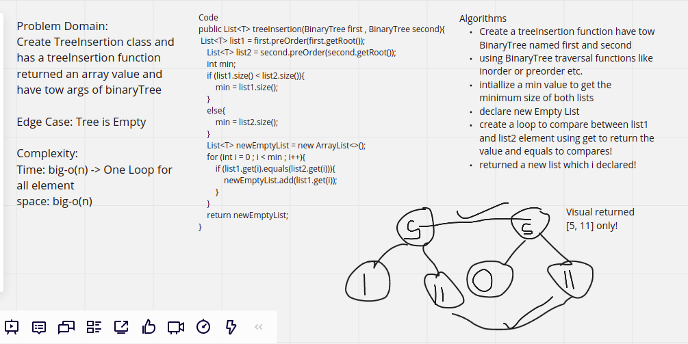

# Challenge Summary

>We Need to find which both array have a same value and sameindex using BinaryTree Functions

# WhiteBoard

# Complixity

big-o(n) for both using a list of element and using a loop to check is equal or not!

# Solution

>**My Code**