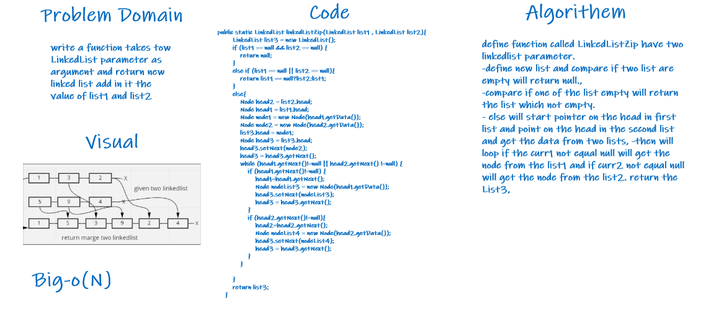

# Challenge Summary

Did it in Algorithem and problem domain 

## Whiteboard Process

## Approach & Efficiency

>**Big-O(N)**

## Solution

Code will declare tow list and made a third test to add the value in it using if, when it's null go out of loop