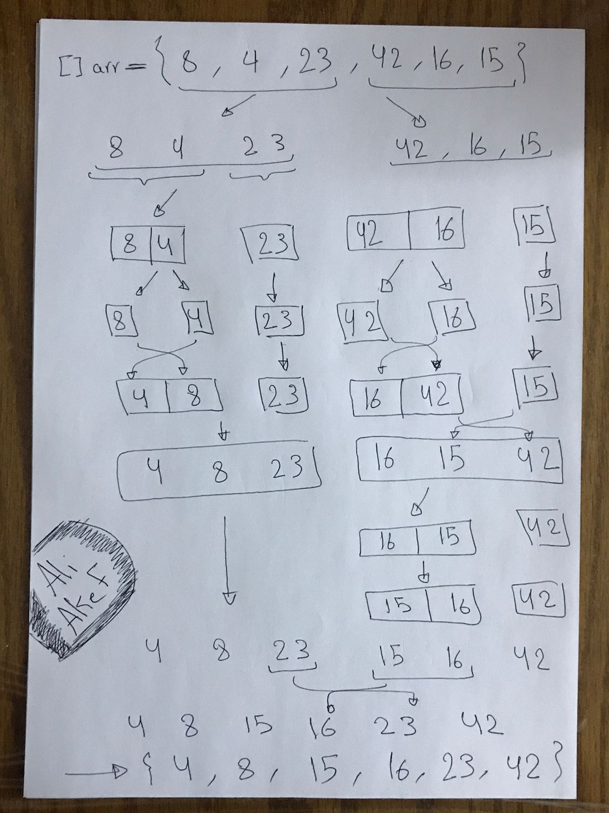
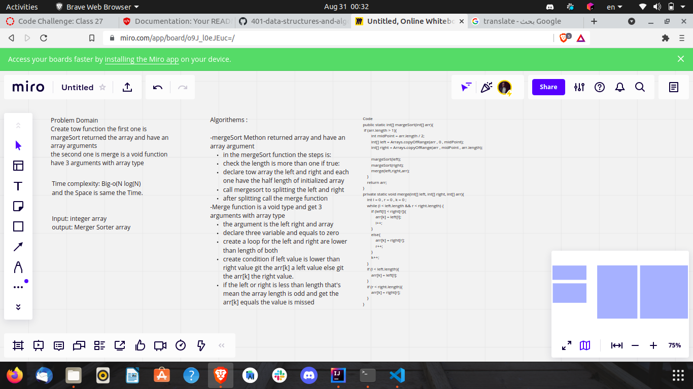

# Challenge Summary

>**that splits the items to be sorted into two groups, recursively sorts each group, and merges them into a final, sorted sequence.**

>-------------------------------------------

## **Blog Image**

>--------------------------------------------

## **WhiteBoard**

>--------------------------------------------

## **Approach & Efficiency**

>**Time and Space equal N*log(N)**

>--------------------------------------------

## **Solution**

    public static int[] margeSort(int[] arr){
            if (arr.length > 1){
                int midPoint = arr.length / 2;
                int[] left = Arrays.copyOfRange(arr , 0 , midPoint);
                int[] right = Arrays.copyOfRange(arr , midPoint , arr.length);

                margeSort(left);
                margeSort(right);
                merge(left,right,arr);
            }
            return arr;
        }
        private static void merge(int[] left, int[] right, int[] arr){
            int l = 0 , r = 0 , k = 0 ;
            while (l < left.length && r < right.length) {
                if (left[l] < right[r]){
                    arr[k] = left[l];
                    l++;
                }
                else{
                    arr[k] = right[r];
                    r++;
                }
                k++;
            }
            if (l < left.length){
                arr[k] = left[l];
            }
            if (r < right.length){
                arr[k] = right[r];
            }
        }