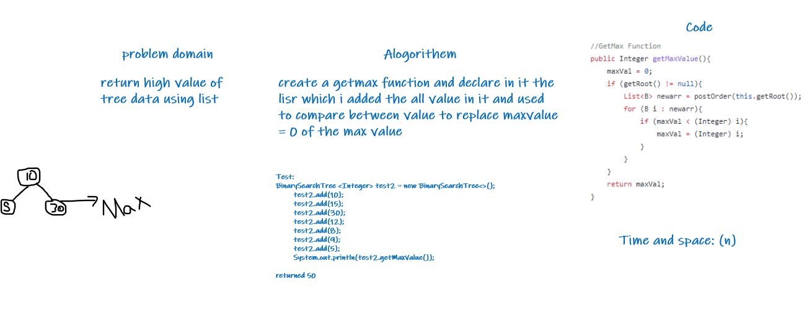
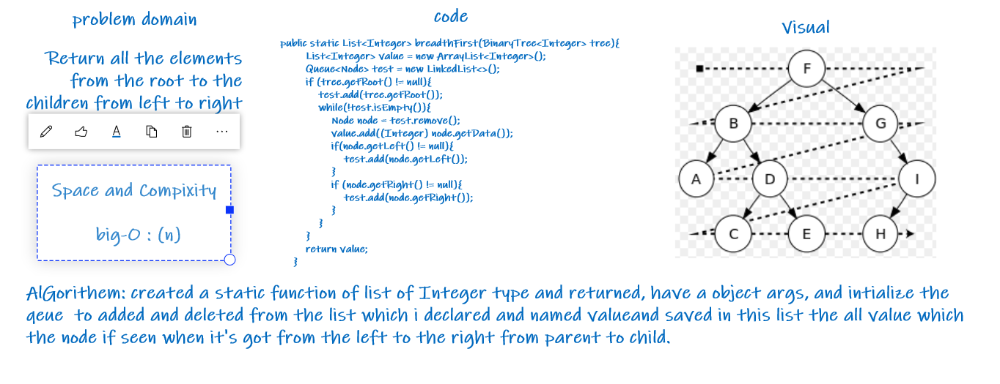
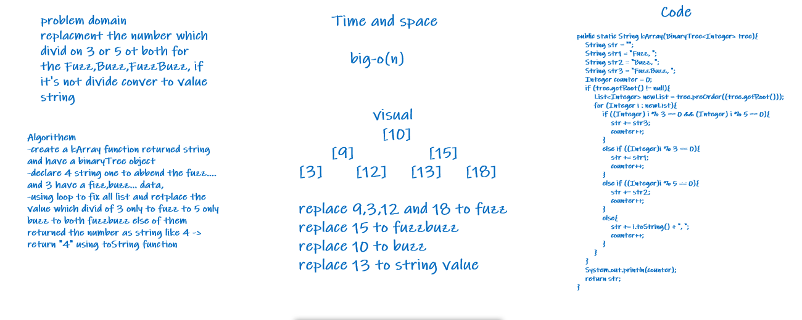

# Tree:

>Using 4 classes to solve the first tow code challenges 

>First one is Node have a left,right and data and getter and setter for these params

>Second one is binary tree usied to pre,post,in order the main function and get max.

* describe who its work the all of these functions like left root right like inorder

>Binary search shown the contain and add to tree

>Complixity and Space = `big-o(n)`

>Needed 3-4 hours todo both code challenges

>-----------------------------------------------------------------------------------

## in CC17:

i used the breadth first function to returned the all leafs from parent to checld started left to right from level 0 to level **N**

time  equals big-o(n)

## in CC18

I used the kArray function to replacing the all number divide of 3 without 5 to Fuzz
I used the kArray function to replacing the all number divide of 5 without 3 to Buzz
I used the kArray function to replacing the all number divide of 3 and 5 to FuzzBuzz
I used the kArray function to replacing the all number not divide of all mentioned to string value.

time : big-o(n)

